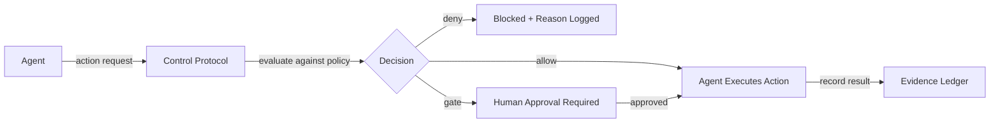
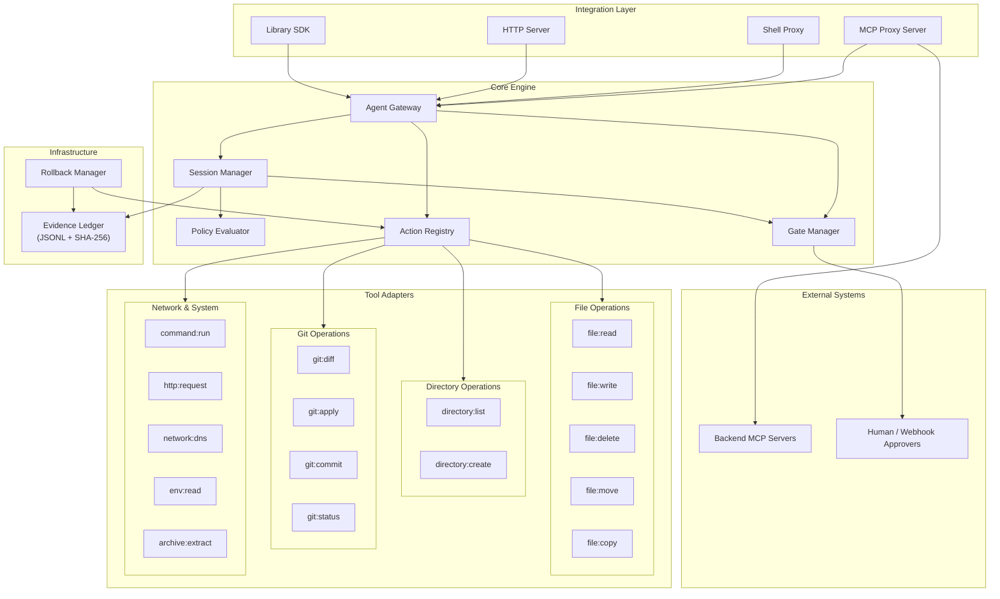
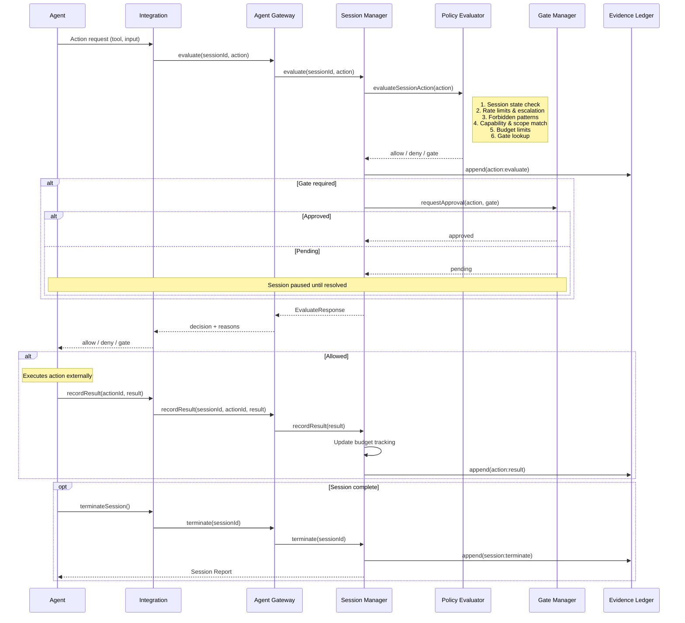
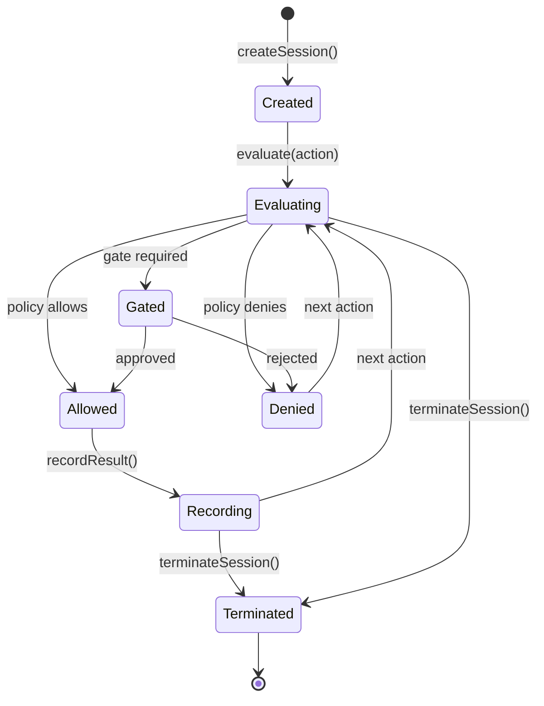

<p align="center">
  
</p>

# Deterministic Agent Control Protocol

[](https://github.com/elliot35/deterministic-agent-control-protocol/stargazers)
[](https://github.com/elliot35/deterministic-agent-control-protocol/network/members)
[](https://github.com/elliot35/deterministic-agent-control-protocol/graphs/contributors)
[](LICENSE)
[](https://www.npmjs.com/package/@det-acp/core)


**A governance gateway for AI agents — making every action bounded, auditable, reversible, and explainable.**

Works transparently with **Cursor**, **Claude Code**, **Codex**, and any MCP-compatible agent. Also supports shell command governance and a language-agnostic HTTP API.

---

## Table of Contents

- [How It Works](#how-it-works)
- [Core Principles](#core-principles)
- [Quick Start](#quick-start)
- [Agent Integrations](#agent-integrations)
- [Built-in Policies](#built-in-policies)
- [Integration Modes](#integration-modes)
- [Architecture](#architecture)
- [Policy DSL Reference](#policy-dsl-reference)
- [Built-in Tool Adapters](#built-in-tool-adapters)
- [Custom Tool Adapters](#custom-tool-adapters)
- [Development](#development)
- [Contributing](#contributing)
- [License](#license)

---

## How It Works

Agents never execute tools directly. Every action flows through the control plane for evaluation, enforcement, and audit:



The protocol **does not execute** actions itself. It evaluates them against a policy, enforces session-level budgets, requires human approval for risky operations, and records everything in a tamper-evident audit ledger.

---

## Core Principles

| Principle | Description |
|-----------|-------------|
| **Bounded** | Agents can only perform allowed actions within allowed scopes |
| **Session-Aware** | Budget, rate limits, and escalation rules across the full interaction |
| **Auditable** | Every action logged in a tamper-evident ledger with SHA-256 hash chaining |
| **Reversible** | Compensation plans for undoing executed actions |
| **Explainable** | Full reporting — what was allowed, denied, gated, and why |

---

## Quick Start

### Install

```bash
npm i @det-acp/core
```

### Set Up Governance (One Command)

```bash
npx det-acp init cursor        # Cursor
npx det-acp init codex         # Codex CLI
npx det-acp init claude-code   # Claude Code
```

This generates all required files (policy, MCP config, governance rules) with sensible defaults. Edit `policy.yaml` to customize — everything else is handled automatically.

```bash
# Use your own policy instead of the default
npx det-acp init cursor --policy ./my-policy.yaml
```

> After running `init`, restart your agent to pick up the MCP server.

### Define a Policy

Create `agent.policy.yaml`:

```yaml
version: "1.0"
name: "my-agent"

capabilities:
  - tool: "file:read"
    scope:
      paths: ["./src/**"]
  - tool: "file:write"
    scope:
      paths: ["./src/**"]
  - tool: "command:run"
    scope:
      binaries: ["npm", "node", "tsc"]

limits:
  max_runtime_ms: 1800000
  max_files_changed: 50

gates:
  - action: "file:delete"
    approval: "human"
    risk_level: "high"

evidence:
  require: ["checksums", "diffs"]
  format: "jsonl"

forbidden:
  - pattern: "**/.env"
  - pattern: "rm -rf"

session:
  max_actions: 100
  max_denials: 10
  rate_limit:
    max_per_minute: 30
  escalation:
    - after_actions: 50
      require: human_checkin
    - after_minutes: 15
      require: human_checkin
```

### Use as a Library

```typescript
import { AgentGateway } from '@det-acp/core';

const gateway = await AgentGateway.create({
  ledgerDir: './ledgers',
  onStateChange: (sessionId, from, to) => console.log(`${from} -> ${to}`),
});

// Create a session
const session = await gateway.createSession('./agent.policy.yaml', {
  agent: 'my-coding-agent',
});

// Evaluate an action (does NOT execute it)
const verdict = await gateway.evaluate(session.id, {
  tool: 'file:read',
  input: { path: './src/index.ts' },
});

if (verdict.decision === 'allow') {
  // Execute the action yourself
  const content = fs.readFileSync('./src/index.ts', 'utf-8');

  // Record the result
  await gateway.recordResult(session.id, verdict.actionId, {
    success: true,
    output: content,
    durationMs: 5,
  });
}

// Terminate and get report
const report = await gateway.terminateSession(session.id, 'task complete');
console.log(`Allowed: ${report.allowed}, Denied: ${report.denied}`);
```

---

## Agent Integrations

Ready-to-use guides for popular AI agents. Each integration includes policy, config templates, governance rules, test sandbox, and step-by-step instructions.

| Agent | Integration Mode | Governance Level | Guide |
|-------|-----------------|-----------------|-------|
| **Cursor** | MCP Proxy + Cursor Rules | Soft | [integrations/cursor/](integrations/cursor/) |
| **Codex CLI** | MCP Proxy + AGENTS.md + OS Sandbox | Soft + Sandbox | [integrations/codex/](integrations/codex/) |
| **Claude Code** | MCP Proxy + CLAUDE.md + settings.json | Soft + Semi-Hard | [integrations/claude-code/](integrations/claude-code/) |
| **OpenClaw** | HTTP API + Skill + Docker Sandbox | Hard | [integrations/openclaw/](integrations/openclaw/) |

<details>
<summary><strong>Governance Levels Explained</strong></summary>

- **Soft** — The LLM is instructed (via rules/instructions files) to prefer governed tools. Effective in practice, but a creative prompt could theoretically bypass it.
- **Semi-Hard** — Soft instructions combined with the agent's built-in permission system that can deny direct tool access (e.g., Claude Code's `settings.json`).
- **Hard** — The agent physically cannot access tools outside the governance layer. Achieved via Docker sandboxing, tool allow/deny lists, or custom agent harnesses.

</details>

For any MCP-compatible agent not listed above, see [MCP Proxy (General)](#mcp-proxy-general).

---

## Built-in Policies

Production-ready policies in `examples/` — usable out of the box:

| Policy | File | Use Case | Tools Used |
|--------|------|----------|------------|
| Coding Agent | [`coding-agent.policy.yaml`](examples/coding-agent.policy.yaml) | AI coding agents operating on a project | 13 tools |
| DevOps Deploy | [`devops-deploy.policy.yaml`](examples/devops-deploy.policy.yaml) | Deployment agents that build, test, and deploy code | 16 tools |
| Video Upscaler | [`video-upscaler.policy.yaml`](examples/video-upscaler.policy.yaml) | Media processing agents running upscaling pipelines | 11 tools |
| Data Analyst | [`data-analyst.policy.yaml`](examples/data-analyst.policy.yaml) | Data analysis agents processing datasets and generating reports | 12 tools |
| Security Audit | [`security-audit.policy.yaml`](examples/security-audit.policy.yaml) | Security scanning agents auditing code and dependencies | 11 tools |
| Infrastructure Manager | [`infrastructure-manager.policy.yaml`](examples/infrastructure-manager.policy.yaml) | Infrastructure management agents handling IaC, deployments, and monitoring | 16 tools |

> Validate any policy with: `npx det-acp validate ./policy.yaml`

---

## Integration Modes

| Mode | How It Works | Best For |
|------|-------------|----------|
| **MCP Proxy** | Transparent proxy between agent and MCP servers | Cursor, Claude Code, any MCP client |
| **Shell Proxy** | Command wrapper that validates before executing | CLI agents, shell-based workflows |
| **HTTP API** | REST endpoints for session management | Any language, custom integrations |
| **Library SDK** | TypeScript API for in-process governance | Custom TypeScript agents |

### MCP Proxy (General)

Works with any MCP-compatible client.

**Simplified mode** — point at a policy file, auto-configures filesystem backend:

```bash
npx det-acp proxy --policy ./policy.yaml
npx det-acp proxy --policy ./policy.yaml --dir /path/to/project
```

<details>
<summary><strong>Full config mode</strong></summary>

For advanced setups with multiple backends, SSE transport, etc.:

```bash
cat > mcp-proxy.config.yaml << 'EOF'
policy: ./agent.policy.yaml
ledger_dir: ./.det-acp/ledgers
transport: stdio
backends:
  - name: filesystem
    transport: stdio
    command: npx
    args: ["-y", "@modelcontextprotocol/server-filesystem", "./src"]
EOF

npx det-acp proxy ./mcp-proxy.config.yaml
```

</details>

### Shell Proxy

Execute commands through the policy gateway:

```bash
npx det-acp exec ./agent.policy.yaml echo "hello"    # Allowed
npx det-acp exec ./agent.policy.yaml rm -rf /tmp      # Denied (forbidden)
```

### HTTP Session Server

```bash
npx det-acp serve --port 3100
```

<details>
<summary><strong>HTTP API Examples</strong></summary>

```bash
# Create a session
curl -X POST http://localhost:3100/sessions \
  -H "Content-Type: application/json" \
  -d '{"policy": "version: \"1.0\"\nname: test\ncapabilities:\n  - tool: file:read\n    scope:\n      paths: [\"./src/**\"]"}'

# Evaluate an action
curl -X POST http://localhost:3100/sessions/<session-id>/evaluate \
  -H "Content-Type: application/json" \
  -d '{"action": {"tool": "file:read", "input": {"path": "./src/index.ts"}}}'

# Record result
curl -X POST http://localhost:3100/sessions/<session-id>/record \
  -H "Content-Type: application/json" \
  -d '{"actionId": "<action-id>", "result": {"success": true, "output": "..."}}'

# Terminate session
curl -X POST http://localhost:3100/sessions/<session-id>/terminate
```

</details>

### CLI Reference

```bash
npx det-acp init <agent>                  # Set up governance (cursor, codex, claude-code)
npx det-acp init <agent> --policy <file>  # Use custom policy
npx det-acp validate <policy-file>        # Validate a policy
npx det-acp proxy --policy <policy-file>  # Start MCP proxy (simplified)
npx det-acp proxy <config-file>           # Start MCP proxy (full config)
npx det-acp exec <policy-file> <command>  # Execute via shell proxy
npx det-acp report <ledger-file>          # View audit report
npx det-acp serve [--port <port>]         # Start HTTP session server
```

---

## Architecture

### Component Architecture



### Action Evaluation Flow



### Session Lifecycle



### Evidence Ledger

Every action produces an immutable audit record in JSONL format with SHA-256 hash chaining:

```jsonl
{"seq":1,"ts":"...","hash":"sha256:abc...","prev":"sha256:000...","type":"session:start","data":{...}}
{"seq":2,"ts":"...","hash":"sha256:def...","prev":"sha256:abc...","type":"action:evaluate","data":{...}}
{"seq":3,"ts":"...","hash":"sha256:ghi...","prev":"sha256:def...","type":"action:result","data":{...}}
```

If any entry is tampered with, the hash chain breaks and integrity verification fails.

---

## Policy DSL Reference

| Section | Purpose |
|---------|---------|
| `capabilities` | Allowed tools and their scoped paths, binaries, or domains |
| `limits` | Runtime, cost, file change, and retry budgets |
| `gates` | Actions requiring human or webhook approval |
| `evidence` | Artifacts that must be recorded (checksums, diffs) |
| `forbidden` | Patterns that are always blocked |
| `session` | Max actions, rate limits, escalation rules |
| `remediation` | Error handling rules and fallback chains |

See [examples/](examples/) for complete policy files.

---

## Built-in Tool Adapters

### File Operations

| Tool | Description | Rollback |
|------|-------------|----------|
| `file:read` | Read files within scoped paths | N/A (read-only) |
| `file:write` | Write files with backup for rollback | Restores previous content |
| `file:delete` | Delete files within scoped paths | Restores file from backup |
| `file:move` | Move/rename files within scoped paths | Moves file back to original location |
| `file:copy` | Copy files within scoped paths | Removes copied file |

### Directory Operations

| Tool | Description | Rollback |
|------|-------------|----------|
| `directory:list` | List files and directories within scoped paths | N/A (read-only) |
| `directory:create` | Create directories within scoped paths | Removes created directories |

### Command Execution

| Tool | Description | Rollback |
|------|-------------|----------|
| `command:run` | Execute allow-listed binaries with timeout | Compensation actions |

### Git Operations

| Tool | Description | Rollback |
|------|-------------|----------|
| `git:diff` | Get git diff output | N/A (read-only) |
| `git:apply` | Apply git patches with stash-based rollback | `git checkout . && git stash pop` |
| `git:commit` | Stage and commit changes | `git reset --soft HEAD~1` |
| `git:status` | Get working tree status | N/A (read-only) |

### Network & HTTP

| Tool | Description | Rollback |
|------|-------------|----------|
| `http:request` | HTTP requests to allow-listed domains | Compensation actions |
| `network:dns` | DNS lookups for allow-listed domains | N/A (read-only) |

### Environment & System

| Tool | Description | Rollback |
|------|-------------|----------|
| `env:read` | Read environment variables with auto-redaction of secrets | N/A (read-only) |
| `archive:extract` | Extract tar/zip archives within scoped paths | Removes extracted files |

---

## Custom Tool Adapters

Extend the `ToolAdapter` base class to add your own tools:

```typescript
import { ToolAdapter } from '@det-acp/core';
import { z } from 'zod';

class MyCustomTool extends ToolAdapter {
  readonly name = 'custom:mytool';
  readonly description = 'My custom tool';
  readonly inputSchema = z.object({
    target: z.string().min(1),
    options: z.record(z.string()).optional(),
  });

  validate(input, policy) { /* ... */ }
  async dryRun(input, ctx) { /* ... */ }
  async execute(input, ctx) { /* ... */ }
  async rollback(input, ctx) { /* ... */ }
}

// Register it
gateway.getRegistry().register(new MyCustomTool());
```

Every tool adapter follows the execution lifecycle: **validate** -> **dryRun** -> **(gate check)** -> **execute** -> **verify**. Each step is recorded in the evidence ledger.

---

## Development

```bash
npm install          # Install dependencies
npm run lint         # Type check (TypeScript strict)
npm test             # Run tests (Vitest)
npm run build        # Build
```

---

## Contributing

Contributions are welcome! Please follow these guidelines:

1. **Fork** the repository and create a feature branch
2. **Follow** the coding standards (TypeScript strict, ESM, Zod validation)
3. **Write tests** mirroring `src/` structure under `tests/`
4. **Run** `npm test && npm run lint` before submitting
5. **Use** [Conventional Commits](https://www.conventionalcommits.org/) for commit messages
6. **Open a PR** with a clear description of changes

---

## License

[MIT](LICENSE)
