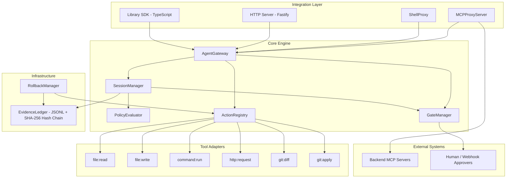
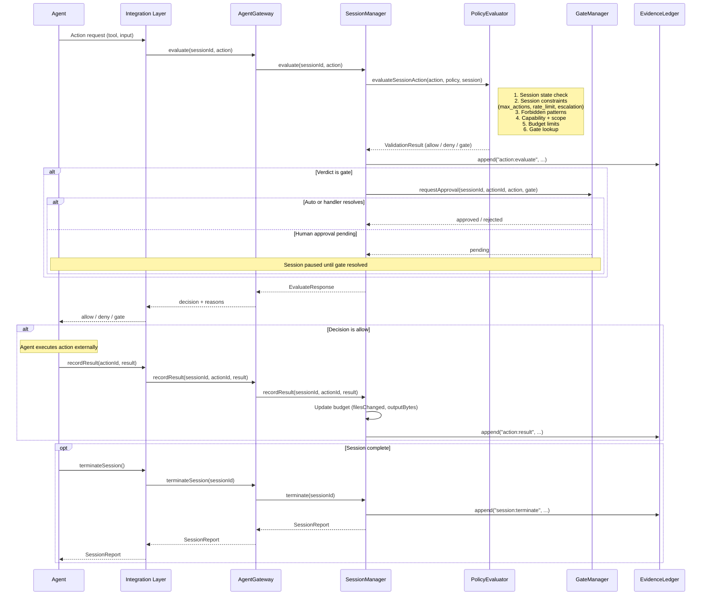

# Deterministic Agent Control Protocol

A governance gateway for AI agents — makes any agent bounded, auditable, reversible, and explainable.

Works transparently with **Cursor**, **Claude Code**, **Codex**, and any MCP-compatible agent via the MCP proxy. Also supports shell command governance and a language-agnostic HTTP API.

## How It Works

Instead of agents executing tools directly, every action flows through the control plane:

```
Agent → Control Protocol (evaluate) → allow / deny / gate
                                          ↓ (if allowed)
                                     Agent executes action
                                          ↓
                                Control Protocol (record result)
```

The control protocol **does not execute** actions — it evaluates them against a policy, enforces session-level budgets, requires human approval for risky actions, and records everything in a tamper-evident audit ledger.

## Core Principles

- **Bounded**: Agents can only perform allowed actions in allowed scopes
- **Session-Aware**: Budget, rate limits, and escalation rules across the full interaction
- **Auditable**: Every action logged in a tamper-evident ledger with SHA-256 hash chaining
- **Reversible**: Compensation plans for undoing executed actions
- **Explainable**: Full reporting — what was allowed, denied, gated, and why

## Quick Start

### Install

```bash
npm install deterministic-agent-control-protocol
```

### Set Up Governance (One Command)

The fastest way to add governance to your AI agent:

```bash
# Cursor
npx det-acp init cursor

# Codex CLI
npx det-acp init codex

# Claude Code
npx det-acp init claude-code
```

This generates all required files (policy, MCP config, governance rules) with sensible defaults. The only file you may want to edit is `policy.yaml` — everything else is handled automatically.

To use your own policy instead of the default:

```bash
npx det-acp init cursor --policy ./my-policy.yaml
```

After running `init`, restart your agent (Cursor, Claude Code, etc.) to pick up the MCP server.

### Define a Policy

Create an `agent.policy.yaml`:

```yaml
version: "1.0"
name: "my-agent"

capabilities:
  - tool: "file:read"
    scope:
      paths: ["./src/**"]
  - tool: "file:write"
    scope:
      paths: ["./src/**"]
  - tool: "command:run"
    scope:
      binaries: ["npm", "node", "tsc"]

limits:
  max_runtime_ms: 1800000
  max_files_changed: 50

gates:
  - action: "file:delete"
    approval: "human"
    risk_level: "high"

evidence:
  require: ["checksums", "diffs"]
  format: "jsonl"

forbidden:
  - pattern: "**/.env"
  - pattern: "rm -rf"

session:
  max_actions: 100
  max_denials: 10
  rate_limit:
    max_per_minute: 30
  escalation:
    - after_actions: 50
      require: human_checkin
    - after_minutes: 15
      require: human_checkin
```

### Use as a Library

```typescript
import { AgentGateway } from 'deterministic-agent-control-protocol';

const gateway = await AgentGateway.create({
  ledgerDir: './ledgers',
  onStateChange: (sessionId, from, to) => console.log(`${from} -> ${to}`),
});

// Create a session
const session = await gateway.createSession('./agent.policy.yaml', {
  agent: 'my-coding-agent',
});

// Evaluate an action (does NOT execute it)
const verdict = await gateway.evaluate(session.id, {
  tool: 'file:read',
  input: { path: './src/index.ts' },
});

if (verdict.decision === 'allow') {
  // Execute the action yourself (or via your agent)
  const content = fs.readFileSync('./src/index.ts', 'utf-8');

  // Record the result
  await gateway.recordResult(session.id, verdict.actionId, {
    success: true,
    output: content,
    durationMs: 5,
  });
}

// When done, terminate and get report
const report = await gateway.terminateSession(session.id, 'task complete');
console.log(`Allowed: ${report.allowed}, Denied: ${report.denied}`);
```

---

## Agent Integrations

Ready-to-use integration guides for popular AI agents. Each integration includes a policy, config templates, governance rules, test sandbox, and step-by-step instructions.

| Agent                 | Integration Mode                      | Governance Level | Guide                                               |
| --------------------- | ------------------------------------- | ---------------- | --------------------------------------------------- |
| **Cursor**      | MCP Proxy + Cursor Rules              | Soft             | [integrations/cursor/](integrations/cursor/)           |
| **Codex CLI**   | MCP Proxy + AGENTS.md + OS Sandbox    | Soft + Sandbox   | [integrations/codex/](integrations/codex/)             |
| **Claude Code** | MCP Proxy + CLAUDE.md + settings.json | Soft + Semi-Hard | [integrations/claude-code/](integrations/claude-code/) |
| **OpenClaw**    | HTTP API + Skill + Docker Sandbox     | Hard             | [integrations/openclaw/](integrations/openclaw/)       |

### Governance Levels Explained

- **Soft**: The LLM is instructed (via rules/instructions files) to prefer governed tools. Effective in practice, but a creative prompt could theoretically bypass it.
- **Semi-Hard**: Soft instructions combined with the agent's built-in permission system that can deny direct tool access (e.g., Claude Code's `settings.json`).
- **Hard**: The agent physically cannot access tools outside the governance layer. Achieved via Docker sandboxing, tool allow/deny lists, or custom agent harnesses.

For any MCP-compatible agent not listed above, see the general MCP Proxy setup below.

---

## Other Integration Modes

### MCP Proxy (General)

The MCP proxy works with any MCP-compatible client, not just Cursor.

**Simplified mode** — just point it at a policy file and it auto-configures a filesystem backend:

```bash
npx det-acp proxy --policy ./policy.yaml
npx det-acp proxy --policy ./policy.yaml --dir /path/to/project  # custom project dir
```

**Full config mode** — for advanced setups with multiple backends, SSE transport, etc.:

```bash
# Create a proxy config
cat > mcp-proxy.config.yaml << 'EOF'
policy: ./agent.policy.yaml
ledger_dir: ./.det-acp/ledgers
transport: stdio
backends:
  - name: filesystem
    transport: stdio
    command: npx
    args: ["-y", "@modelcontextprotocol/server-filesystem", "./src"]
EOF

# Start the proxy
npx det-acp proxy ./mcp-proxy.config.yaml
```

### Shell Proxy

Execute commands through the policy gateway:

```bash
# Allowed
npx det-acp exec ./agent.policy.yaml echo "hello"

# Denied (rm -rf is forbidden)
npx det-acp exec ./agent.policy.yaml rm -rf /tmp
```

### HTTP Session Server

```bash
# Start the server
npx det-acp serve --port 3100

# Create a session
curl -X POST http://localhost:3100/sessions \
  -H "Content-Type: application/json" \
  -d '{"policy": "version: \"1.0\"\nname: test\ncapabilities:\n  - tool: file:read\n    scope:\n      paths: [\"./src/**\"]"}'

# Evaluate an action
curl -X POST http://localhost:3100/sessions/<session-id>/evaluate \
  -H "Content-Type: application/json" \
  -d '{"action": {"tool": "file:read", "input": {"path": "./src/index.ts"}}}'

# Record result
curl -X POST http://localhost:3100/sessions/<session-id>/record \
  -H "Content-Type: application/json" \
  -d '{"actionId": "<action-id>", "result": {"success": true, "output": "..."}}'

# Terminate session
curl -X POST http://localhost:3100/sessions/<session-id>/terminate
```

### CLI

```bash
# Set up governance for an integration (generates all config files)
npx det-acp init cursor                          # or codex, claude-code
npx det-acp init cursor --policy ./my-policy.yaml  # use custom policy

# Validate a policy
npx det-acp validate ./agent.policy.yaml

# Start MCP proxy (simplified — just a policy file)
npx det-acp proxy --policy ./policy.yaml

# Start MCP proxy (full config file for advanced use)
npx det-acp proxy ./mcp-proxy.config.yaml

# Execute a command through shell proxy
npx det-acp exec ./agent.policy.yaml echo "hello"

# View audit report from ledger
npx det-acp report ./.det-acp/ledgers/<session-id>.jsonl

# Start HTTP session server
npx det-acp serve
```

## Architecture

### Component Architecture



### Action Evaluation Flow



### Session Lifecycle

Every interaction is governed through a session:

```
Create Session → Evaluate Actions → Record Results → Terminate
                     ↕ (repeat)         ↕ (repeat)
                 deny / gate
```

Sessions track:

- Cumulative budget (runtime, files changed, cost)
- Action history (for rate limiting and escalation)
- Pending gates (human approval required)
- Evidence ledger (tamper-evident audit trail)

### Integration Modes

| Mode                  | How it works                                    | Best for                            |
| --------------------- | ----------------------------------------------- | ----------------------------------- |
| **MCP Proxy**   | Transparent proxy between agent and MCP servers | Cursor, Claude Code, any MCP client |
| **Shell Proxy** | Command wrapper that validates before executing | CLI agents, shell-based workflows   |
| **HTTP API**    | REST endpoints for session management           | Any language, custom integrations   |
| **Library SDK** | TypeScript API for in-process governance        | Custom TypeScript agents            |

### Evidence Ledger

Every action produces an immutable audit record in JSONL format with SHA-256 hash chaining:

```jsonl
{"seq":1,"ts":"...","hash":"sha256:abc...","prev":"sha256:000...","type":"session:start","data":{...}}
{"seq":2,"ts":"...","hash":"sha256:def...","prev":"sha256:abc...","type":"action:evaluate","data":{...}}
{"seq":3,"ts":"...","hash":"sha256:ghi...","prev":"sha256:def...","type":"action:result","data":{...}}
```

If any entry is tampered with, the hash chain breaks and integrity verification fails.

### Policy DSL

Policies define:

| Section          | Purpose                                                          |
| ---------------- | ---------------------------------------------------------------- |
| `capabilities` | What tools the agent can use and where                           |
| `limits`       | Runtime, cost, file change, and retry budgets                    |
| `gates`        | Actions that require human/webhook approval                      |
| `evidence`     | What artifacts must be recorded                                  |
| `forbidden`    | Patterns that are always blocked                                 |
| `session`      | Session-level constraints (max actions, rate limits, escalation) |
| `remediation`  | Error handling rules and fallback chains                         |

### Built-in Tool Adapters

| Tool             | Description                                 |
| ---------------- | ------------------------------------------- |
| `file:read`    | Read files within scoped paths              |
| `file:write`   | Write files with backup for rollback        |
| `command:run`  | Execute allow-listed binaries with timeout  |
| `http:request` | HTTP requests to allow-listed domains       |
| `git:diff`     | Get git diff output                         |
| `git:apply`    | Apply git patches with stash-based rollback |

### Custom Tool Adapters

Extend the `ToolAdapter` base class:

```typescript
import { ToolAdapter } from 'deterministic-agent-control-protocol';

class MyCustomTool extends ToolAdapter {
  name = 'custom:mytool';
  description = 'My custom tool';
  inputSchema = z.object({ /* ... */ });

  validate(input, policy) { /* ... */ }
  async dryRun(input, ctx) { /* ... */ }
  async execute(input, ctx) { /* ... */ }
  async rollback(input, ctx) { /* ... */ }
}

// Register it
gateway.getRegistry().register(new MyCustomTool());
```

## Development

```bash
# Install dependencies
npm install

# Type check
npm run lint

# Run tests
npm test

# Build
npm run build
```

## License

MIT
